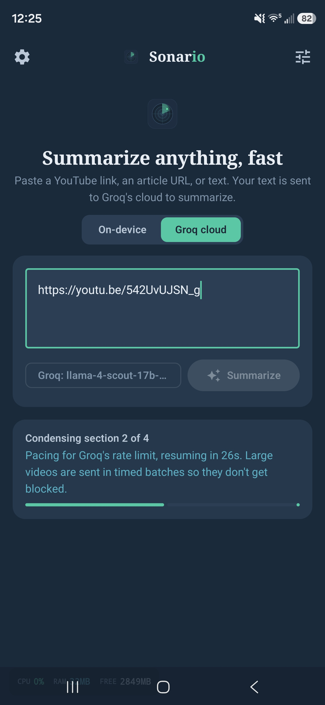
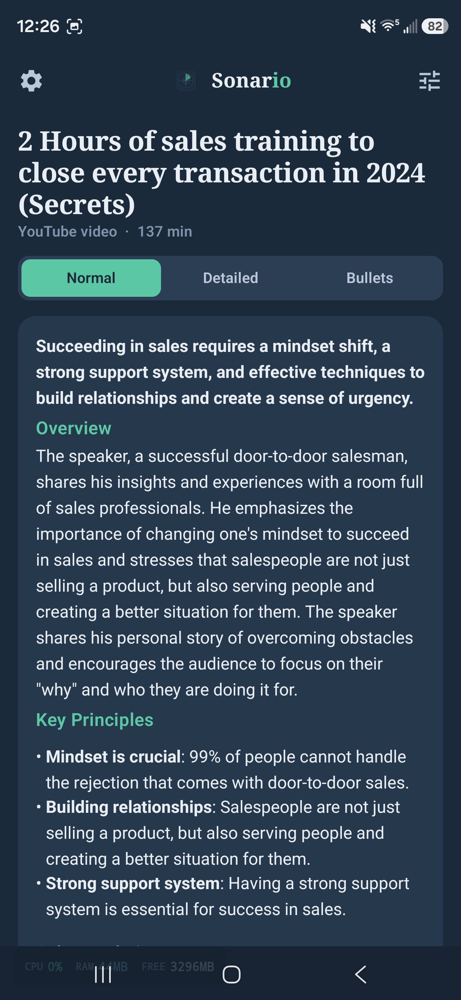
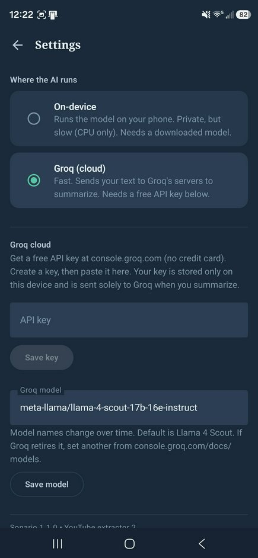

# Sonario for Android

Summarize YouTube videos, web articles, and pasted text on your phone. Paste a
link (or share one into the app) and get skimmable notes, a detailed prose view,
or a bulleted outline.

**Status:** working. YouTube transcript summarization, web-article and pasted-text
summarization, Groq cloud, on-device inference, saved sessions, resumable
checkpoints, and source Q&A are functional as of version 1.3.3.

Sonario has two engines, and you pick which to use per summary:

- **Groq cloud** (recommended) - sends your text to Groq's API and summarizes
  with a large model (Llama 4 Scout by default) in seconds. Fast, handles big
  documents in one pass. You bring your own free API key. Your text goes to
  Groq's servers.
- **On-device** - runs a model locally via llama.cpp. Private (nothing leaves the
  phone except fetching the link), but slow: CPU-only, so a summary takes minutes
  and the phone warms up. A private fallback rather than the daily driver.

## Highlights

- Summarizes YouTube captions, web articles, pasted text, PDF, EPUB, DOCX, TXT,
  and Markdown files.
- Keeps long cloud summaries alive with a foreground service and retries
  temporary DNS, timeout, and network-handoff failures.
- Saves up to 12 recent sessions locally, restores the latest session on launch,
  and resumes from checkpoints without repeating completed model calls.
- Includes Normal, Detailed, Bullets, and chapter views, plus source-grounded
  **Ask about this** Q&A.
- Lets users delete one session or clear all locally stored transcripts,
  summaries, checkpoints, and Q&A history.

## Screenshots

> Add three screenshots to `docs/screenshots/` (`main.png`, `summary.png`,
> `setup.png`) - see that folder's README. Until then these images show as broken.

  
  &nbsp;
  
  &nbsp;
  

  <em>Left: paste a link and pick an engine. Center: a summarized YouTube video
  with Normal / Detailed / Bullets views. Right: first-run setup.</em>

## Quick start (Groq cloud, the fast path)

1. Install the APK (see below) and open Sonario.
2. On the first screen, tap **Use Groq cloud instead** (skips the local-model
   download).
3. Get a free Groq API key at console.groq.com (no credit card). Create a key.
4. In Sonario's Settings, paste the key and tap **Save key**.
5. Back on the main screen, make sure the toggle is on **Groq cloud**, paste a
   YouTube link or article URL, and tap **Summarize**.

## Quick start (on-device, fully private)

1. Open Sonario. On the first screen, tap **Get** on a model (Qwen2.5 1.5B is the
   fastest). It downloads in-app (~1 GB, use Wi-Fi).
2. When it finishes, make sure the toggle is on **On-device**, paste a source,
   and tap **Summarize**. Expect it to take a few minutes; the CPU meter at the
   bottom-left will sit near 100%.

## Supported links

YouTube links in any common shape all work:

- `youtu.be/VIDEO_ID` (short link)
- `youtube.com/watch?v=VIDEO_ID`
- `m.youtube.com/watch?v=VIDEO_ID` (mobile)
- `youtube.com/shorts/VIDEO_ID`, `/live/VIDEO_ID`, `/embed/VIDEO_ID`
- Extra share parameters like `?si=...` are ignored.

You can also share a link from the YouTube or browser app straight into Sonario
via the Android share sheet. Web article URLs and raw pasted text also work.

## Privacy, stated plainly

The two engines differ, and the app shows which is active:

- On-device: summarization happens locally. The only network calls are the
  one-time model download and fetching whatever link you paste.
- Groq cloud: the text to summarize is sent to Groq. Don't use this for anything
  you wouldn't send to a third-party API. Your Groq key is stored only on your
  device (local app storage) and is sent solely to Groq.

## How YouTube transcripts are fetched

Sonario uses a layered extractor rather than relying on one caption URL:

1. Load the watch page in one cookie-preserving session and handle YouTube's
   consent page when it appears.
2. Read the current InnerTube API key, WEB client version, visitor data, and the
   real `getTranscriptEndpoint.params` value from YouTube's page data.
3. Prefer `youtubei/v1/next` -> `youtubei/v1/get_transcript`, which returns the
   transcript segments directly as JSON.
4. Fall back to consistently identified ANDROID and WEB `player` requests, then
   download an available caption track.
5. Parse JSON3, legacy XML, SRV3, TTML, or WebVTT captions.

The extractor preserves signed caption URL parameters when changing formats and
reports Proof-of-Origin-token tracks accurately instead of claiming the video has
no captions. These are still undocumented YouTube endpoints, so a future YouTube
change can require another extractor update. Failed requests show **Extractor
build 2** diagnostics so you can confirm the new APK is actually installed.

## Background reliability and Ask fixes (1.2.0)

- Cloud requests now retry transient DNS, Wi-Fi/mobile-data handoff, connection,
  and timeout failures for up to ten minutes instead of immediately ending with
  `Unable to resolve host api.groq.com`.
- A foreground service holds a partial CPU wake lock and a temporary Wi-Fi lock
  only while a summary or source question is active. The notification displays
  rate-limit waits and network-retry status.
- Groq responses are buffered before being committed to a summary, so a failed
  connection can be retried without duplicating a partial response.
- The Ask box now shows the actual API/network error in place, keeps the typed
  question after a failure, and searches relevant passages across the whole
  source instead of sending only the first portion of a long video or book.
- Long jobs have a visible Cancel control, stale errors clear when a new source is
  entered, and the app no longer treats a failed Ask call as a successful generic
  answer.

## On-device models (downloaded on first run, not bundled)

| Model | Size | Notes |
| --- | --- | --- |
| Qwen2.5 1.5B Instruct | ~1.1 GB | Fastest on-device; the default |
| Llama 3.2 3B Instruct | ~2.0 GB | Better output, slower |
| Phi-3.5 Mini Instruct | ~2.3 GB | Larger context, slowest |

Q4_K_M GGUF from public Hugging Face repos, downloaded at first launch to
`Android/data/ai.sonario.app/files/models/`. Never bundled in the APK.

On-device inference is CPU-only: the llama.cpp build here has no Adreno GPU
backend, so on a Snapdragon phone every token is generated on CPU. It works and
is genuinely private, but Groq is far more practical for everyday use.

## Crash diagnostics

If the app ever crashes, it writes the stack trace to
`Android/data/ai.sonario.app/files/last_crash.txt` and shows it on the next
launch (with a Copy button) instead of silently closing.

## Architecture

Kotlin/Jetpack Compose. Both engines implement one interface, `InferenceEngine`,
and the summarize pipeline talks only to that:

- `llm/InferenceEngine.kt` - shared interface (`ensureReady`, `stream`).
- `llm/LlmEngine.kt` - on-device via Llamatik/llama.cpp.
- `llm/GroqEngine.kt` - Groq cloud via the OpenAI-compatible streaming API.
- `llm/ModelDownloader.kt` - resumable GGUF download.
- `data/Settings.kt` - engine choice, Groq key, Groq model (local prefs).
- `source/SourceFetcher.kt` - YouTube (InnerTube) and web-article fetching.
- `summarize/SummarizeEngine.kt` - map-reduce summarizer; chunking adapts to the
  engine (small bounded chunks on-device, large/one-pass for the 128k cloud model).
- `summarize/Prompts.kt` - prompts carried over from Sonario desktop.
- `ui/` - Compose screens, theme, settings, the CPU/RAM meter, crash screen.
- `CrashReporter.kt` - global uncaught-exception logger.

To add another backend (e.g. a self-hosted llama.cpp/Ollama server on a PC),
implement `InferenceEngine` and hand it to `SummarizeEngine`. `GroqEngine` is the
template for an HTTP-based engine.

## Build

See BUILD.md.

## Credits

Port of Sonario desktop by pgotta. On-device inference via llama.cpp/Llamatik;
cloud inference via Groq.

## License

MIT. See LICENSE.

## Clear all saved sessions (1.3.1)

The Recent sessions card now has a **Clear** button. After confirmation, it permanently deletes all locally saved session folders, including source transcripts, chapter data, summaries, checkpoints, and saved Q&A. Exported files outside the app are left alone.

## Saved and resumable sessions (1.3.0)

Sonario now saves summaries locally instead of keeping the only copy in an Activity/ViewModel. The most recent session is restored after an app or Activity restart, and a Recent sessions panel can open, resume, or delete prior work.

For long summaries, Sonario checkpoints after every completed LLM call. If Android or the network interrupts the run, Resume skips already-completed condensed chunks and derived views so those Groq tokens are not spent twice. Completed source text and Ask history are stored with the session. Up to 12 recent sessions are retained in the app's private files directory.

## Keyboard-safe Ask field (1.3.3)

The Ask field follows the software keyboard into view, supports two to four
lines of editing, offers the keyboard Send action, and preserves unfinished text
across ordinary Activity recreation.
